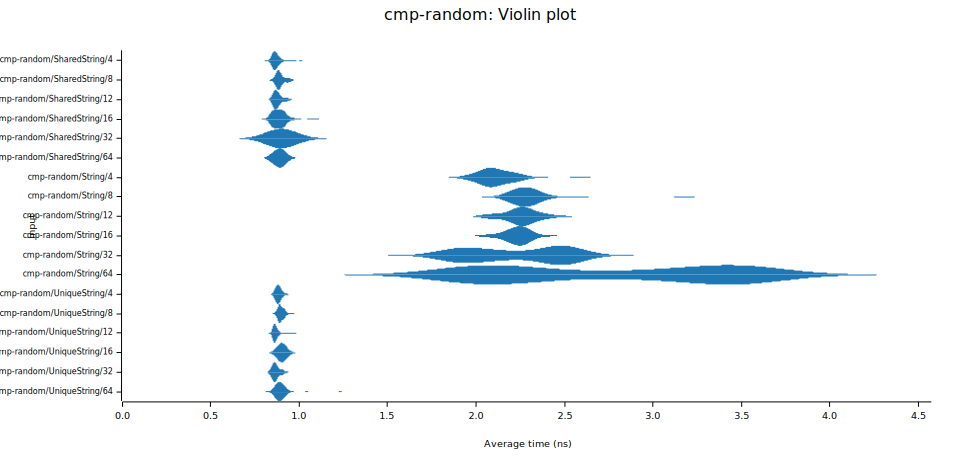
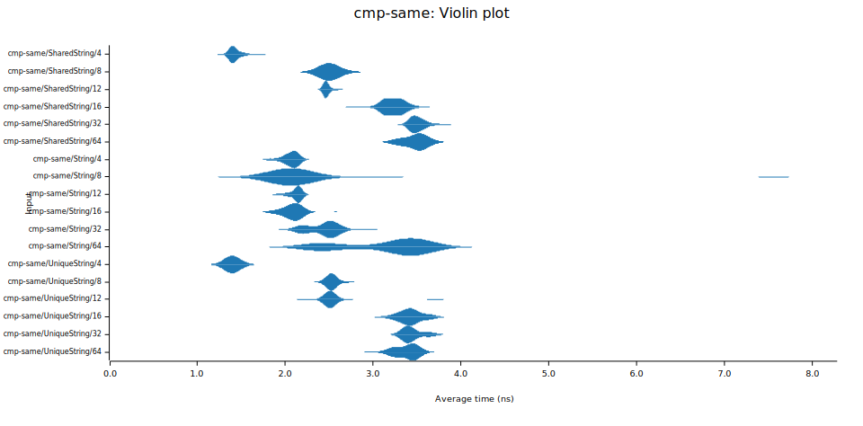

# Strumbra

An implementation for the string data structure as described in [Umbra: A Disk-Based System with In-Memory Performance](https://www.cidrdb.org/cidr2020/papers/p29-neumann-cidr20.pdf).

2 different types are implemented:
+ `UniqueString` behaves like a `Box<str>`.
+ `SharedString` behaves like a `Arc<str>`.

## Properties

+ Strings are immutable.
+ Strings can only have a maximum length of `u32::MAX`.
+ Strings whose length is less than or equal to 12 are stack-allocated.
+ Comparing and ordering is relatively fast and cache-friendly for most strings.

## Benchmarks

Very simple micro-benchmarks were conducted to compare the performance of ordering strings of the different types - `String`, `UniqueString`, and `SharedString`. We see no difference between `UniqueString` and `SharedString` as expected since they share the exact comparison implementation. When comparing 2 different random strings, performance is much better with `UniqueString` and `SharedString` because most comparisons only use the first few bytes.

On the other hand, comparing 2 identical strings yields better results using `UniqueString` and `SharedString` only when the strings have 4 bytes, so only the prefixes are compared. Otherwise, due to the conditional branches, `UniqueString` and `SharedString` perform similarly to `String` when the strings can still be inlined and worse when the strings can't.

